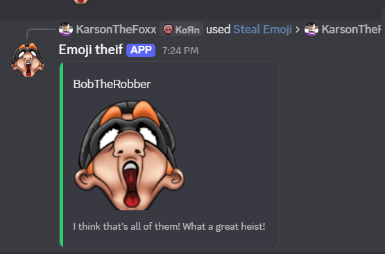

# Welcome to Emoji Thief
Tired of searching for emojis you spot on discord that you wish to use? Just install this user app and steal the emoji!
Emoji Thief is able to turn all custom static and animated emojis into a downloadable PNG or GIF for easy emoji gathering.

This project was inspired from izzythesillyfox requesting an emoji from another member, I had an AHA! moment and decided to try and make a bot that can do this easily and quickly anywhere on Discord!

IMPORTANT!!!!!
READ THE TOS AND PRIVACY POLICY!
[You can find those here](https://github.com/KarsonTheFoxx/Emoji-Thief)

Emoji Thief is very easy to use
Just follow the 4 simple steps below to get started!
1. Find an emoji you like (preferably get permission to take it)
2. Right click (long press on mobile) the message containing the emoji
3. Select the apps option in the menu that shows up
4. Select the Steal Emoji option

Emoji Thief will then work it's magic and within seconds you will have the downloadable PNG or GIF directly in your chat!

(I am aware "thief" is spelled wrong. I am kinda stupid OK, waiting for discord support to come change it because verified apps cannot be changed without them for some reason)

LIMITATIONS:
1. Discord imposes a hard limit of 10 images on a message, for this reason Emoji Thief can only gather the first 10 emojis in a message and will not gather anything past the first 10
2. Emoji Thief cannot grab emojis from embeds it can only grab emojis that are in a regular text message

TODO:
1. Implement a way for Emoji Thief to gather more than 10 emojis from a message (This will likely be a UI, seperate embed or formatting it into a zip file)
2. Implement the ability to read embed content such as bot embeds
3. Implement GIF support (Allowing Emoji Thief to find the name of a GIF so you can find it in the built in GIF search)
4. Potentally create a community/support server if the userbase grows large enough (THIS MAY NEVER HAPPEN)
5. Potentally implement an in app way to submit feedback

CHANGELOG:
1. June 12th 2026
> Project creation and upload to Github
